# WaybillApp — Учёт путевых листов (ASP.NET Core 8 + SQLite)

## Быстрый старт

```bash
# 1. Установить .NET 8 SDK (https://dotnet.microsoft.com/download)

# 2. Перейти в папку проекта
cd WaybillApp

# 3. Применить миграцию (создаст waybill.db автоматически при первом запуске)
dotnet ef migrations add InitialCreate
dotnet ef database update

# 4. Запустить
dotnet run

# Открыть: https://localhost:5001
```

## Вход по умолчанию

| Логин | Пароль   | Роль          |
|-------|----------|---------------|
| admin | admin123 | Администратор |

После первого входа создай операторов и водителей через раздел **Пользователи**.

## Роли

| Роль        | Путевые листы | Водители/ТС | Нормы | Пользователи |
|-------------|:---:|:---:|:---:|:---:|
| **admin**   | Все действия | Все | Все | ✅ |
| **operator**| Создание, правка, экспорт | Создание, правка | Создание, правка | ❌ |
| **driver**  | Просмотр своих | Просмотр | Просмотр | ❌ |

## Как изменить нормы расхода

1. Войти как **admin** или **operator**
2. Раздел **Нормы топлива → Добавить норму**
3. Ввести новую базовую норму и коэффициенты
4. Указать **«Действует с»** — нужную дату

> Система автоматически применяет норму, действовавшую на дату каждого листа.
> Старые листы пересчитываются по нормам, которые действовали в тот момент.

## Структура проекта

```
WaybillApp/
├── Controllers/
│   ├── AccountController.cs      # Логин, регистрация пользователей (admin)
│   ├── WaybillsController.cs     # Путевые листы, печать, Excel
│   ├── OtherControllers.cs       # Водители, ТС, Нормы
│   └── HomeController.cs         # Дашборд
├── Services/
│   └── WaybillService.cs         # !Вся бизнес-логика и расчёты
├── Models/
│   └── Models.cs                 # Driver, Vehicle, Waybill, FuelNorm, ApplicationUser
├── Data/
│   └── AppDbContext.cs           # EF Core DbContext
├── Views/                        # Razor Views
└── wwwroot/css|js/               # Стили и скрипты
```

## Формула расчёта нормы

```
ставка = базовая_норма
       × (1 + K_груз)   — если рейс с грузом
       × (1 + K_зима)   — если зимний период
       × (1 + K_город)  — если маршрут по городу (не загород)

расход_по_норме (л) = пробег_км × ставка / 100
```

**По умолчанию:** базовая = 23.8, K_груз = 0.05, K_город = 0.10, K_зима = 0.20

## Зависимости

- `Microsoft.AspNetCore.Identity.EntityFrameworkCore`
- `Microsoft.EntityFrameworkCore.Sqlite`
- `Microsoft.EntityFrameworkCore.Tools`
- `ClosedXML` (экспорт Excel)

## Скриншоты интерфейса

| Страница | Старая версия / Просмотр | Новая версия / Редактирование |
| :--- | :---: | :---: |
| **Вход в систему** | <a href="img/screenshots/login.png">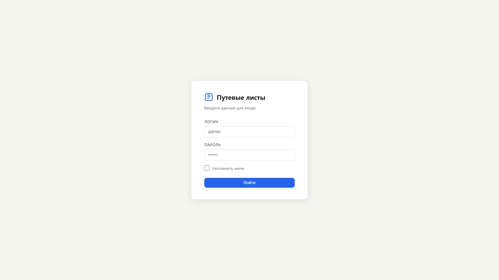</a> | — |
| **Главная (Админ)** | <a href="img/screenshots/index-admin.png">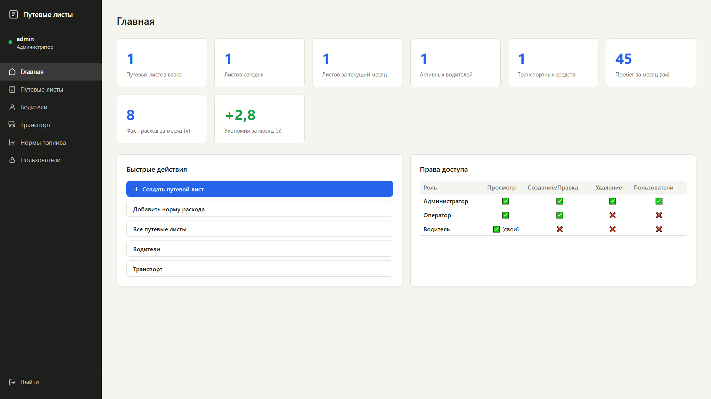</a> | — |
| **Водители** | <a href="img/screenshots/drivers-table.png">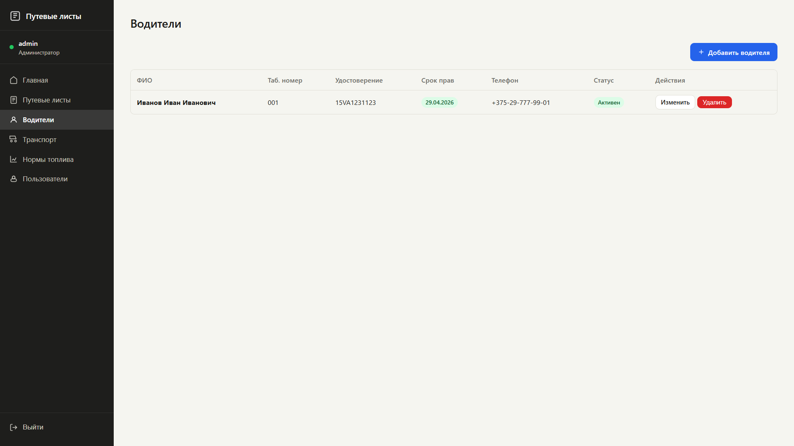</a> | <a href="img/screenshots/drivers-table-new.png">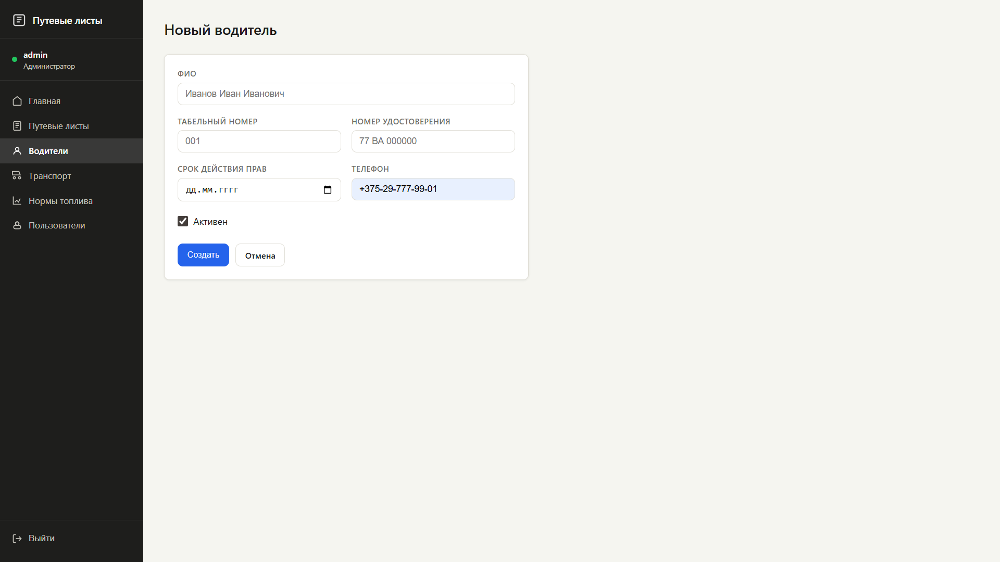</a> |
| **Нормы топлива** | <a href="img/screenshots/fuelnorm-table.png">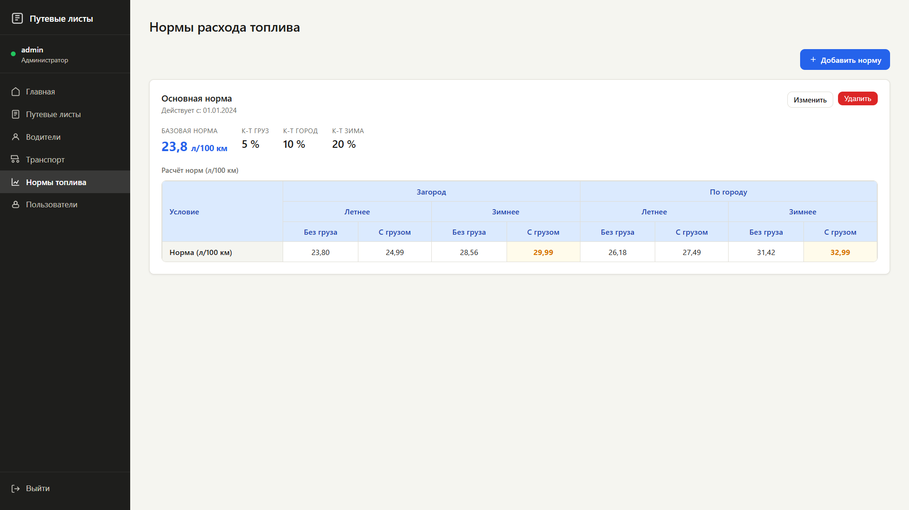</a> | <a href="img/screenshots/fuelnorm-table-new.png">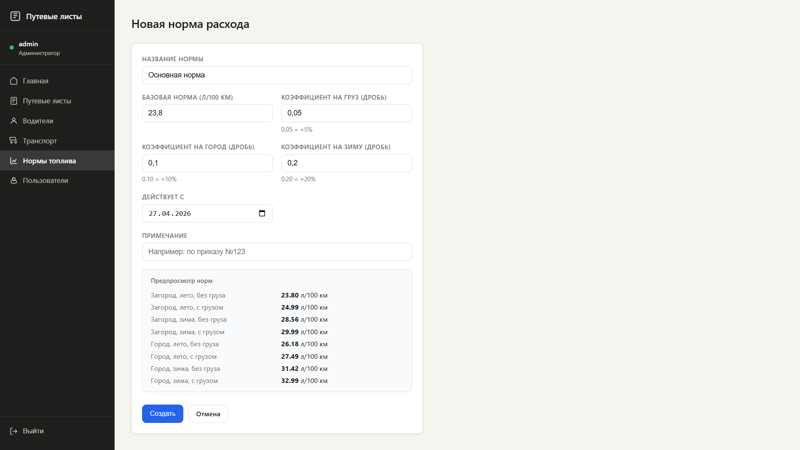</a> |
| **Пользователи** | <a href="img/screenshots/users-table.png">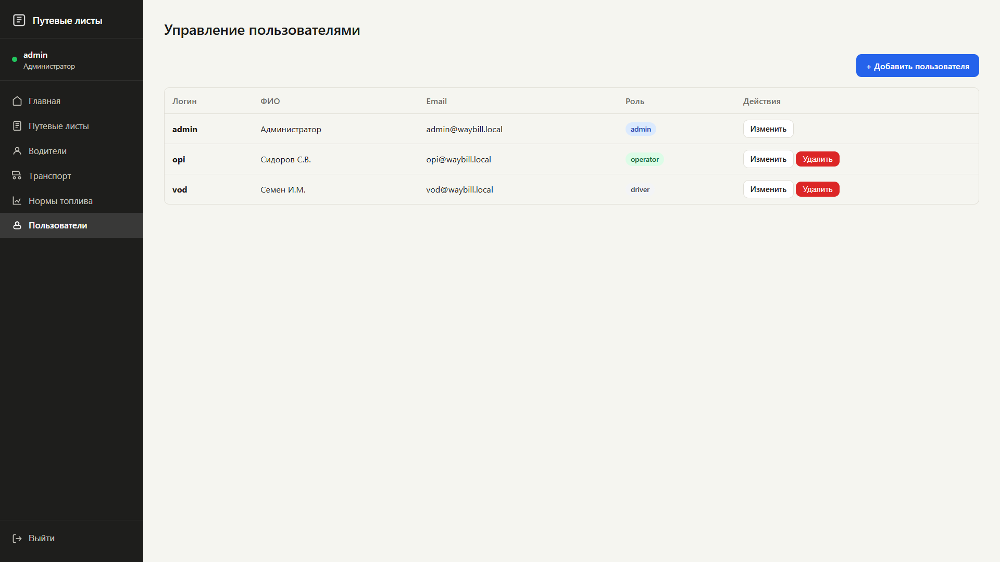</a> | <a href="img/screenshots/users-table-new.png">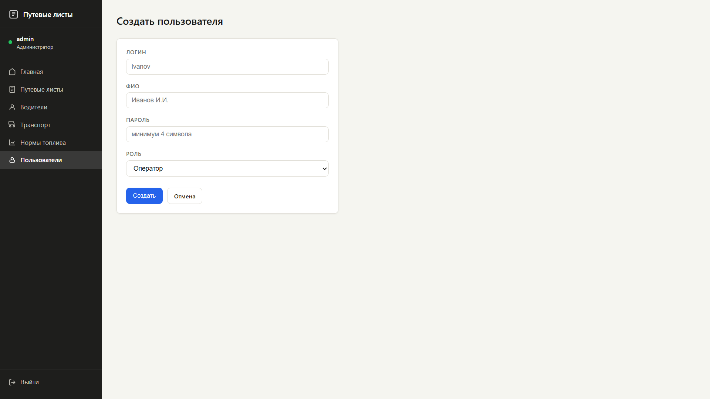</a> <br> [Редактирование](img/screenshots/users-table-edit.png) |
| **Транспорт** | <a href="img/screenshots/vehicle-table.png">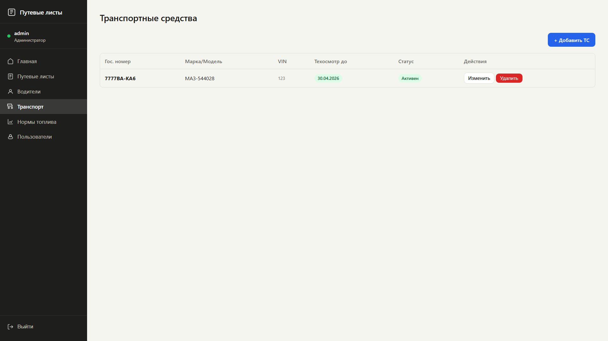</a> | <a href="img/screenshots/vehicle-table-new.png">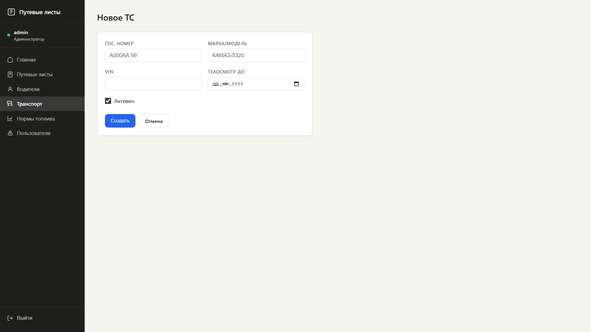</a> |
| **Путевые листы** | <a href="img/screenshots/waybill-table.png">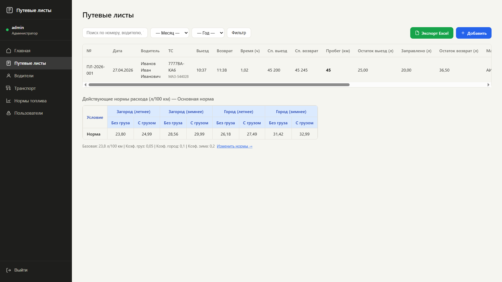</a> | <a href="img/screenshots/waybill-table-new.png">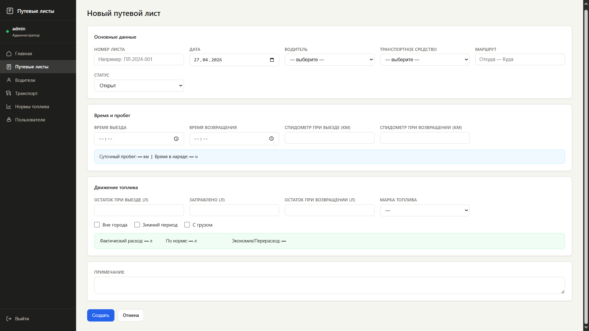</a> |
